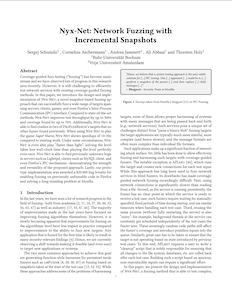

# Nyx-Net: Network Fuzzing with Incremental Snapshots

<a href="https://doi.org/10.1145/3492321.3519591">  </a>

Nyx-Net is fast full-VM snapshot fuzzer for complex network based targets. It's built upon [kAFL](https://github.com/RUB-SysSec/kAFL), [Redqueen](https://github.com/RUB-SysSec/redqueen) and [Nyx](https://github.com/RUB-SysSec/nyx). The approach is described in more detail in our [paper](https://arxiv.org/pdf/2111.03013.pdf).

# Note:
This repository is serving only to capture the state as described in the paper. If you want to actually use Nyx, check out the maintained code released for the [Nyx framework](https://github.com/nyx-fuzz/nyx) or it's [Homepage](https://nyx-fuzz.com). 

```
@inproceedings{nyx-net,
author = {Schumilo, Sergej and Aschermann, Cornelius and Jemmett, Andrea and Abbasi, Ali and Holz, Thorsten}, 
title = {Nyx-Net: Network Fuzzing with Incremental Snapshots}, 
booktitle = {Proceedings of the Seventeenth European Conference on Computer Systems}, 
series = {EuroSys '22} 
year = {2022},
}
```

## Setup

Please note that the minimum requirements to get Nyx-Net running are a recent linux kernel installed (>= v5.11) and full access to KVM. Fast-Snapshots and compile-time based tracing is supported by an unmodified vanilla kernel. If you want to fuzz closed-source targets with Nyx-Net's intel-PT mode, you will need to install [KVM-Nyx](https://github.com/nyx-fuzz/kvm-nyx).

The following commands will install all dependencies and setup Nyx-Net an your machine (assuming an Ubuntu 21.04): 

```
git clone https://github.com/RUB-SysSec/nyx-net
cd nyx-net
./setup.sh
```

## ProFuzzBench

To setup all ProfuzzBench targets you can use a Dockerfile which we provide with this repository. Using Docker is necessary because most of the targets will not compile on more recent linux distributions. This process will take several minutes to finish. Because of that, we provide two ZIP-archives (ASAN and non-ASAN), which contain a prepared collection of all targets. 

To unpack the PFB builds from one of the archives, move to the `targets` folder and run either `decompress_packed_targets.sh` or `decompress_packed_targets_asan.sh`.

Optional: to compile and pack the targets using the Dockerfile move to the `targets` folder and then run `docker_pack.sh`. Once the this process has successfully finished, use the `decompress_packed_targets.sh` or `decompress_packed_targets_asan.sh` to finish the setup process. 


## Super Mario

Run the following script to compile and prepare the Super Mario Demo. This scripts expects the NES ROM of Super Mario Bros. (MD5: `811b027eaf99c2def7b933c5208636de`) to be located at `targets/extra_folders/super_mario_extra_folder/Super Mario Bros. (JU) (PRG0) [!].nes`:

```
cd targets/
./prepare_super_mario.sh
```

This script will compile the x86 version of Super Mario Bros and create a Nyx sharedir for each level. The Nyx sharedirs will be put into the `targets/packed_targets/` folder. 

# Run the Fuzzer

Move to the `fuzzer/rust_fuzzer` folder and run the following command to start the fuzzer:

```
cargo run --release -- \
      -s ../../targets/packed_targets/<TARGET>/
```

Incremental snapshots are disabled by default (Nyx-Net-None) but you can enable them by adding an `-p` parameter with one of the two available policies (`balanced` or `aggressive`). Parallel-fuzzing can also be enabled be using the `-t <threads>` parameter. Nyx-Net will automatically create a crash report once a crash of the target has been observed during fuzzing. Those reports are stored in the working directory (`corpus/crash/*.log`).

### Reproducabilty

The fuzzer will store each new interesting input in the working directory. However, those inputs are stored in a specific bytecode format and cannot easily be used to replay the communication with a target running outside of Nyx. To turn those inputs into a more usable format, you need to re-run each finding in the corpus by another tool which is stored in `fuzzer/rust_fuzzer_debug`:

```
cargo run --release -- \
      -s ../../targets/packed_targets/<TARGET>/ \
      -d /tmp/workdir/corpus/crash/ \
      -t /tmp/workdir/corpus/crash_reproducible/
```

This tool will pick and re-execute each input form the `crash` folder and generate a more usable version which is then put into the `crash_reproducible` folder. To replay one of the files from the `crash_reproducable` folder, move to the `packer/packer/` directory and use the `nyx_net_payload_executor.py` tool:

```
#supported modes: stdout, udp, tcp
python nyx_net_payload_executor.py /tmp/workdir/corpus/crash_reproducable/cnt_10.py stdout > /tmp/trace; hexdump -C /tmp/trace
```

### ProfuzzBench

To reproduce the evaulation and results from the paper, you can use the scripts and tools located in `profuzzbench-nyx/`.
More details on that can be found [here](https://github.com/RUB-SysSec/nyx-net-profuzzbench).

### License

The content of this repository is provided under **AGPL license**. 
However, this does only apply to this repository without any submodule. Please refer to each submodule from this repository to get more detailed information on each license used.

**Free Software Hell Yeah!** 

Proudly provided by: 
* [Sergej Schumilo](http://schumilo.de) - sergej@schumilo.de / [@ms_s3c](https://twitter.com/ms_s3c)
* [Cornelius Aschermann](https://hexgolems.com) - cornelius@hexgolems.com / [@is_eqv](https://twitter.com/is_eqv)
